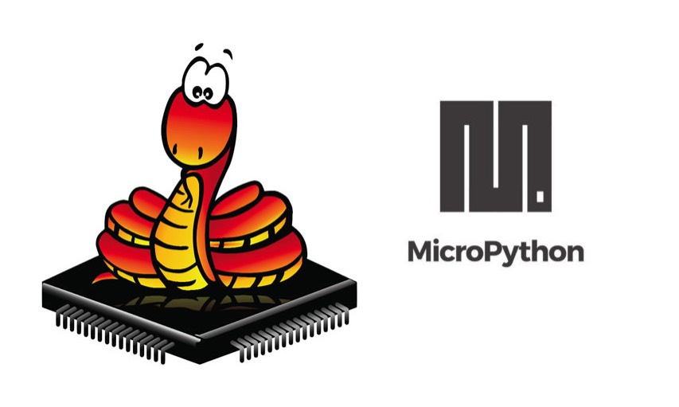
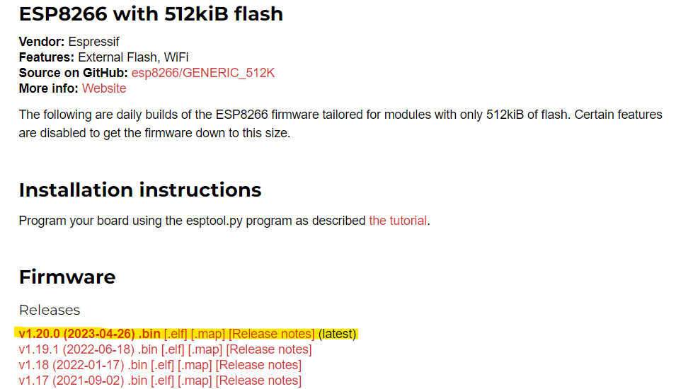
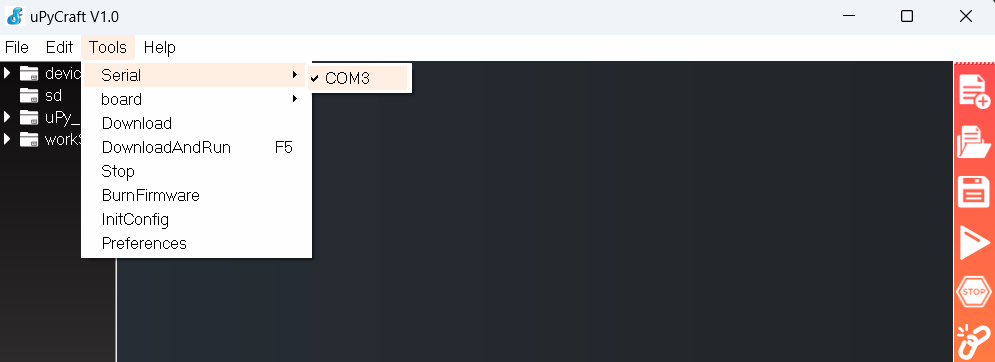
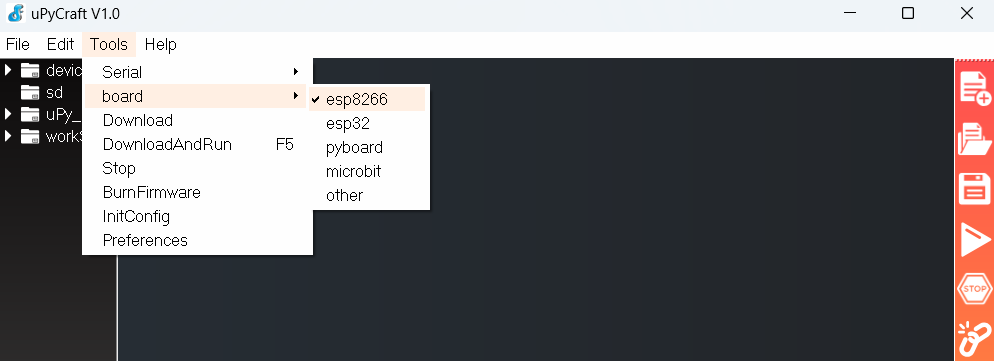
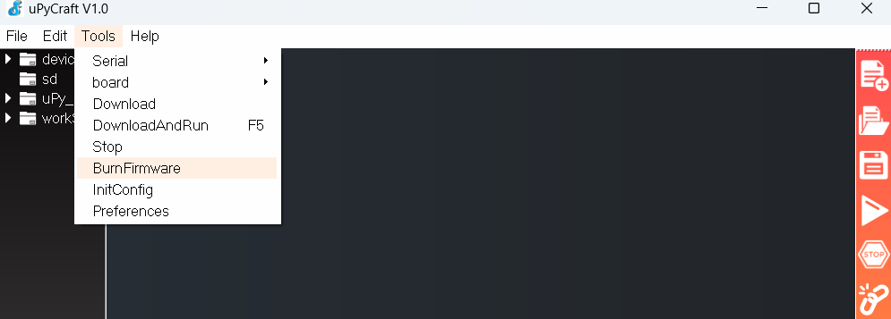
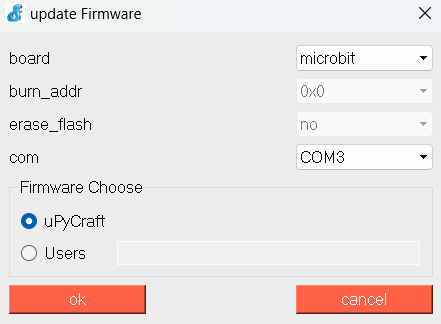
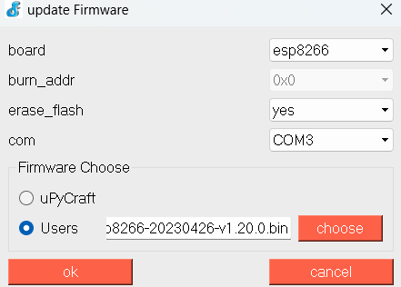
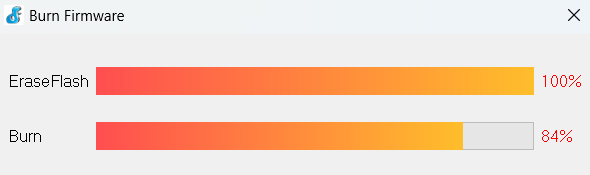

# Instalação e configuração do MicroPython no ESP8266

---

---
# MicroPython
O [MicroPython](https://micropython.org/) é uma implementação da linguagem de programação Python que é otimizada para sistemas embarcados e dispositivos de recursos limitados. Ele oferece uma maneira simplificada de programar microcontroladores e placas de desenvolvimento, como o ESP8266, ESP32, Arduino e outros, permitindo que os desenvolvedores usem a linguagem Python para controlar hardware e criar aplicativos embarcados. O MicroPython é projetado para ser eficiente em termos de espaço e recursos, o que o torna uma escolha popular para a prototipagem rápida e o desenvolvimento de projetos IoT (Internet das Coisas) que exigem interações com sensores, atuadores e comunicações.

# uPyCraft IDE
Para facilitar o desenvolvimento de scripts e até mesmo a gravação do firmware da nossa placa, vamos usar a uPyCraft IDE. Essa ferramenta foi especialmente projetada para microPython.

Depois você pode escolher a IDE que mais gosta eu vou ultilizar o [Pycharm](https://www.jetbrains.com/pycharm/download/?section=windows)
## Instalação do uPyCraft IDE
Instale a versão correspondente ao seu sitema operacional no repositório do projeto.

A DFRobot deixou disponíveis os links para download em sua [documentação](https://docs.dfrobot.com/upycraft/):
* [uPyCraft IDE](https://raw.githubusercontent.com/DFRobot/uPyCraft/master/uPyCraft.exe) (Windows)
* [uPyCraft IDE](https://raw.githubusercontent.com/DFRobot/uPyCraft/master/uPyCraft_mac_V1.0.zip) (Mac)
* [uPyCraft IDE](https://git.oschina.net/dfrobot/upycraft/raw/master/uPyCraft_linux_V0.30) (Linux)

Assim que acabar de baixar é so executar o programa e prosseguir com as seguintes etapas. 
# Gravando o Firmware do MicroPython na nodeMCU
Para conseguir programar a nodeMCU ou outra placa com ESP8266 é necessário atualizar o firmware.

Baixe o firmware no site do [MicroPython.](https://micropython.org/download/)

Procure o firmware ideal para a sua placa este da imagem é para o meu caso pode não ser o seu por isso fique atento.

Agora vamos usar o uPyCraft para gravar o firmware na placa.

Abra o uPyCraft e vá em **Tools > Serial** e selecione a porta Serial para a sua placa.No meu caso foi a COM3:

Selecione a placa em **Tools > board:**

Agora acesse **Tools > BurnFirmware:**

Vai abrir está janela:

Agora você vai fazer a configuração para a sua placa.
No meu caso vai ficar assim:
* board: **esp8266**
* burn_addr: **0x0**
* erase_flash: **yes**
* com: **COM3**
* Firmware: Selecione **"Users"** e então selecione o arquivo que você baixou do site do MicroPython.

Clique em OK e aguarde a gravação do firmware:

Quando terminar sua placa nodeMCU já está pronta para ser programada em **MicroPython**

## Procedimentos:
* Fazer o download do Firmaware para a sua placa 
* Fazer o download do uPyCraft 
* Fazer o Download do CP210x_Windows_Drivers para instalar os drivers necessarios 
* Configurar 

