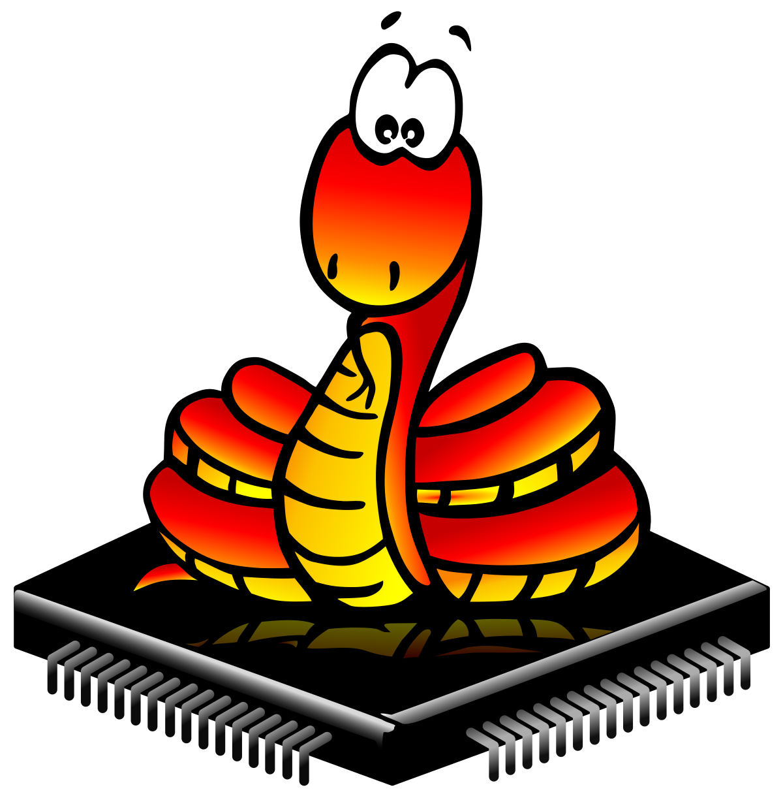

# Instalação e configuração do MicroPython

---

---
## Procedimentos:
* Fazer o download do Firmaware para a sua placa 
* Fazer o download do uPyCraft 
* Fazer o Download do CP210x_Windows_Drivers para instalar os drivers necessarios 
* Configurar 

